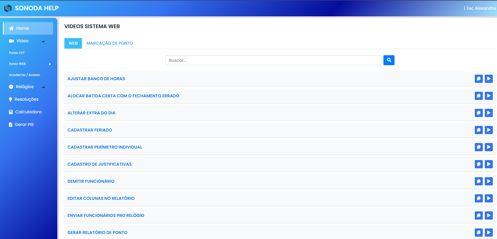

# SONODA HELP 👋

Criado para auxilio nos atendimentos, deixando o mais rapido e prático.
Alem de auxiliar os tecnicos novos.

## Tecnologias usadas

- JS
- HTML5
- CSS

Como é algo simples, não precisei me aprofundar muito em outras linguagens, porem
pode ser necessário para algumas ideias que tenho em mente.

